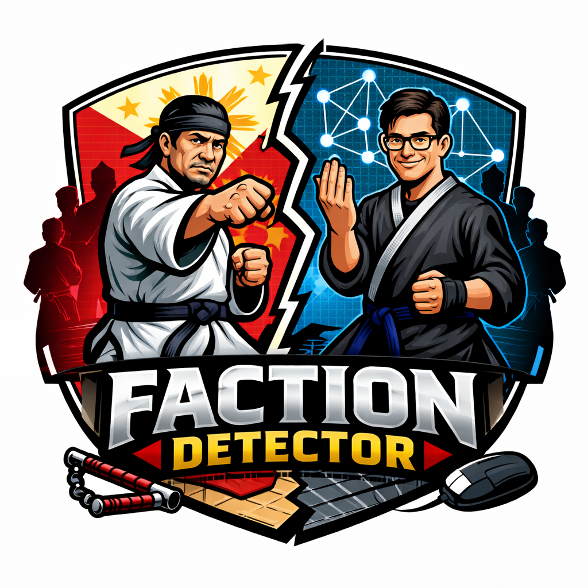

### **Faction Detector**

[](https://github.com/jasperblues/faction-detector/actions/workflows/maven.yml) [](https://github.com/embabel/embabel-agent)   

<br clear="left"/>

> *Open source projects fork. Enterprise codebases rot. The review graph tells you which one is coming — and when.*

Gauge the health of open (or closed!) source projects using nothing but pull request comment dynamics.

📖 **[Faction Detection — Reading the Review Graph Before the Fork](https://medium.com/p/75e100898160)** — how 1970s network science (Zachary's Karate Club) applies to GitHub PR review graphs. Covers the full pipeline from asymmetry scoring through community detection to LLM-powered classification, with retrodiction results across 15 repos.

Faction Detector analyses GitHub PR review activity to detect contributor faction dynamics and predict project splits. It builds a weighted directed graph of who reviews whom, runs community detection, and scores asymmetry across rolling time windows — then feeds everything into an LLM for narrative analysis.

Built with [Embabel](https://github.com/embabel/embabel-agent) + [Neo4j](https://neo4j.com) + [Neo4j Graph Data Science](https://neo4j.com/docs/graph-data-science/current/) + [Spring Boot](https://spring.io/projects/spring-boot).

---

## What it detects

| Pattern | Description |
|---------|-------------|
| `FRACTURE_ADVERSARIAL_FORK` | Internal faction war: 9+ weeks of sustained high asymmetry AND adversarial comment signal above baseline. The strongest claim the tool makes. |
| `FRACTURE_UPRISING` | Community unified against an external steward: 9+ weeks of high asymmetry, but low faction signal (contributors were aligned, not fighting each other) plus post-resolution re-escalation. |
| `GOVERNANCE_CRISIS` | Real structural disruption visible in the review graph — organisational restructuring, corporate withdrawal, or brief crisis — but without fork-level evidence. |
| `FRACTURE_IMMINENT` | Unresolved factional tension with adversarial review signal — split may be imminent. Requires both high asymmetry AND adversarial evidence (avgFactionSignal or crossCommunityScore >= 0.065); without adversarial signal, downgrades to TENSION. |
| `TENSION` | Elevated review asymmetry without adversarial dynamics. Common in single-gatekeeper or BDFL projects where structural asymmetry is high but reviews are constructive. Worth monitoring but not an imminent fork risk. |
| `EXODUS` | Gradual sustained elevation that resolved — coordinated departure without adversarial spike |
| `ATTRITION` | Natural contributor lifecycle turnover — succession problem, not faction problem |
| `STABLE` | No significant asymmetry detected |

> **Minimum data requirement:** 4 months (120 days) of PR review history. A confirmed fork pattern requires 9 consecutive weeks of elevated asymmetry plus pre- and post-cluster context — roughly 16 rolling windows.

---

## Example: The node-pocolypse (2013–2015)

```
faction-detector:> analyse --repo nodejs/node --since 2013-06-01 --until 2015-06-01
```

```
+----------------+-----------------------------------+
| Pattern        | FRACTURE_ADVERSARIAL_FORK         |
| Severity       | EXTREME                           |
| Confidence     | 75%                               |
| Peak tension   | 2014-12-10 (asymmetry 1.00)       |
| Status         | RESOLVED — RE-ESCALATION DETECTED |
| Fracture event | 2015-01-17                        |
| Resolution     | 2015-01-24                        |
+----------------+-----------------------------------+
```

The io.js fork was announced December 9, 2014. The review graph peaked **November 15** — 3 weeks earlier. The model found the right people, the right month, the right severity from review patterns alone. No commit messages. No mailing lists. No drama threads.

---

## Limitations

- **Minimum project size**: Results are unreliable for projects with fewer than ~5 active reviewers in a given window. When only 2–3 people are reviewing, asymmetry scores collapse to binary 0/1 noise — the metric requires a real reviewer graph to be meaningful. Projects in managed decline (e.g. a framework superseded by its own successor) often fall below this threshold and can produce spurious FRACTURE_IMMINENT readings.
- **GitHub PR reviews only**: The tool only sees review activity on GitHub pull requests. Projects that use email, Gerrit, Phabricator, or bot-mediated approvals will appear to have little or no data.
- **Review asymmetry ≠ conflict**: High asymmetry can reflect structural specialisation (separate frontend/backend teams) as well as adversarial dynamics. The LLM narrative attempts to distinguish these, but treat results as signals to investigate, not verdicts.
- **Comment scoring model**: Stage-2 comment scoring uses `claude-haiku-4-5` by default for speed and cost. Haiku tends to classify ambiguous comments as `FAIR` rather than `NITPICKY`, which slightly suppresses faction signals on marginal cases. To use a more nuanced model, change `AnthropicModels.CLAUDE_HAIKU_4_5` to `AnthropicModels.CLAUDE_SONNET_4_5` in `ReviewCommentScorer.kt` and bump `COMMENT_SCORE_CACHE_VERSION` to invalidate cached scores. Note that if you tune `DetectorWeights` to compensate for Haiku's FAIR bias, those weights will not transfer correctly to Sonnet.
- **Bot accounts**: Accounts matching common bot patterns (`[bot]`, `-bot`) and a built-in list of known service accounts (codecov-io, coveralls, CLAassistant, etc.) are filtered automatically. Project-specific automation accounts (e.g. `elasticmachine`) are not. If the narrative mentions a bot or automation account as a significant reviewer or bridge figure, re-run with the `--bots` flag to exclude it:
  ```
  analyse --repo elastic/elasticsearch --since 2020-01-01 --bots elasticmachine,merge-bot
  ```

---

## Prerequisites

### Java (JDK 21+)

If you don't have Java installed, the easiest way is [SDKMAN](https://sdkman.io) — a version manager that works on Mac and Linux:

```bash
curl -s "https://get.sdkman.io" | bash   # installs SDKMAN
sdk install java 21-tem                  # installs Temurin JDK 21
```

On Mac you can also use Homebrew: `brew install openjdk@21`

Verify it worked: `java -version` should show `21` or higher.

### Docker

Neo4j (the graph database) runs in Docker. Install [Docker Desktop](https://www.docker.com/products/docker-desktop/) if you don't have it, then verify with `docker ps`.

### GitHub personal access token

Create one at **GitHub → Settings → Developer settings → Personal access tokens → Fine-grained tokens**. It only needs read access to public repositories — no write permissions required.

### Anthropic API key

Get one at **[console.anthropic.com](https://console.anthropic.com)**.

---

## Neo4j with Docker

Faction Detector requires Neo4j with the **Graph Data Science (GDS)** plugin for community detection. Start it with:

```bash
docker run \
  --name neo4j-factions \
  -p 7474:7474 -p 7687:7687 \
  -v $HOME/.neo4j-factions/data:/data \
  -e NEO4J_AUTH=neo4j/brahmsian \
  -e NEO4J_PLUGINS='["graph-data-science"]' \
  neo4j:5
```

On first start Neo4j downloads and installs GDS automatically — allow a minute or two. Once ready, open `http://localhost:7474` and run:

```cypher
CREATE DATABASE factions IF NOT EXISTS
```

> **Note:** Tests use a Neo4j testcontainer automatically — no local Neo4j needed to run the test suite.

---

## Running

### Quick start (no API keys or Neo4j needed)

The repo ships with pre-computed snapshots for every case in the corpus — the full pipeline output cached as gzipped JSON. When a snapshot matches your repo + date range, the entire upstream pipeline is skipped: no GitHub API calls, no Neo4j graph queries, no LLM scoring. The Neo4j driver is created at startup but connects lazily, so it never fails if no server is running.

This means you can clone, build, and run immediately with nothing but a JVM:

```bash
./mvnw install -DskipTests
./faction analyse --repo nodejs/node --since 2013-06-01 --until 2015-06-01   # snapshot hit — instant
./faction analyse --repo redis/redis --since 2021-01-01 --until 2024-09-01   # snapshot hit — instant
```

Any repo/window combination that matches a committed snapshot skips the entire pipeline. See [Testing > Snapshot cache](#snapshot-cache) for the full list of cached cases.

### Analysing new repos

To analyse repos or date ranges not in the snapshot cache, you need the full pipeline:

**1. Set your API keys**

```bash
export FACTION_GITHUB_TOKEN=ghp_...    # GitHub personal access token
export ANTHROPIC_API_KEY=sk-ant-...    # Anthropic API key
```

**2. Start Neo4j** — see [Neo4j with Docker](#neo4j-with-docker).

**3. Build** (if you haven't already)

```bash
./mvnw install -DskipTests
```

**4a. Interactive shell**

```bash
./mvnw spring-boot:run
```

Then at the prompt:

```
faction-detector:> analyse --repo nodejs/node --since 2013-06-01 --until 2015-06-01
faction-detector:> analyse --repo redis/redis --days 365
```

**4b. One-shot CLI**

```bash
./faction analyse --repo nodejs/node --since 2013-06-01 --until 2015-06-01
./faction analyse --repo redis/redis --days 365
```

Useful for batch runs or scripting hypotheses overnight:

```bash
#!/bin/bash
./faction analyse --repo nodejs/node --since 2018-06-01 --until 2020-01-01
./faction analyse --repo babel/babel  --since 2020-06-01 --until 2022-06-01
./faction analyse --repo rust-lang/rust --since 2021-06-01 --until 2023-01-01
```

New analyses automatically save snapshots, so subsequent runs of the same repo/window are instant.

---

## How it works

1. Fetch all PR review comments from the GitHub API for the repo + date range
2. Build a directed weighted graph: reviewer → author edges
3. Score each reviewer→author pair for asymmetry and anomaly vs baseline
4. Run Neo4j GDS Louvain community detection on the weighted graph
5. Roll a 30-day window across the period, computing asymmetry ratio per window
6. Detect peak clusters, classify fracture pattern, detect contributor exodus step-changes
7. Feed everything into an LLM for narrative analysis

---

## Testing

```bash
mvn test                                    # unit tests (no external dependencies)
mvn test -DexcludedGroups='' -Dgroups=e2e   # E2E corpus tests (uses snapshot cache)
```

### E2E corpus

The corpus includes 36 test cases across 16 repos — confirmed fractures (nodejs io.js, redis Valkey, terraform BSL, moby Docker Enterprise, RedisGraph/FalkorDB, gogs/gitea, chef/Cinc, presto/trino), true negatives (kubernetes, django, rails, fastapi, next.js), pre-fork early warnings, and quiet-period validations.

### Snapshot cache

The repo ships with gzipped snapshots (`src/main/resources/snapshots/`) that capture the full intermediate pipeline state (edges, windowed scores, LLM-scored pairs, community assignments) for every corpus case. When a snapshot exists, the entire upstream pipeline is skipped — **no GitHub API calls, no Neo4j, no LLM scoring required.**

This means you can **run the main app against any corpus repo/window** immediately after cloning — no API keys, no Neo4j, no waiting for GitHub crawls:

```bash
./mvnw install -DskipTests
./faction analyse --repo nodejs/node --since 2013-06-01 --until 2015-06-01   # instant — snapshot hit
./faction analyse --repo redis/redis --since 2021-01-01 --until 2024-09-01   # instant — snapshot hit
```

Only novel repo/window combinations that aren't in the snapshot cache will trigger the full pipeline (requiring Neo4j + API keys).

E2E tests also load snapshots from the classpath, so they work in CI and on a fresh checkout with no external dependencies beyond a JVM.

**Run from cache** (default — works anywhere):
```bash
mvn test -DexcludedGroups='' -Dgroups=e2e
```

**Force a full recompute** (requires Neo4j + GitHub token + Anthropic key):
```bash
FACTION_FRESH=true mvn test -DexcludedGroups='' -Dgroups=e2e
```
This bypasses all snapshots, runs the full pipeline from scratch, and saves fresh snapshots. Use this after changing detector logic, scoring models, or edge construction.

### Contributing a new test case

Found an interesting fork, governance crisis, or true negative? Here's how to add it:

1. **Add an exploratory test** in `CorpusE2ETest.kt`:
   ```kotlin
   @Test
   fun `myrepo interesting event 2022-2024 EXPLORATORY`() {
       val result = analyse("owner/repo 2022-01-01 2024-01-01")
       println(diagMsg(result))
   }
   ```

2. **Run it locally** (requires Neo4j, GitHub token, and Anthropic API key):
   ```bash
   mvn test -DexcludedGroups='' -Dgroups=e2e \
       -Dtest='CorpusE2ETest#myrepo interesting*'
   ```
   This fetches data from GitHub, runs the full pipeline, and saves a snapshot to `src/main/resources/snapshots/`.

3. **Review the output** — check the pattern, confidence, departed contributors, and whether it matches what actually happened.

4. **Lock it in** — replace `println(diagMsg(result))` with `assertPattern(TensionPattern.THE_PATTERN, result)` and update the test name.

5. **Submit a PR** with:
   - The new test in `CorpusE2ETest.kt`
   - The generated snapshot file(s) in `src/main/resources/snapshots/`
   - A comment in the test explaining the historical context and why the expected pattern is correct

---

## Contributors

[](https://github.com/jasperblues/faction-detector/graphs/contributors)

---

> ⚠️ **Disclaimer:** This is a demonstration of what's possible with [Embabel](https://github.com/embabel/embabel-agent) and [Neo4j](https://neo4j.com). The corpus of 26 cases across 15 repos holds up well, but this is early work — treat results as signals to investigate, not verdicts. No open source projects were harmed in the making of this tool. Any resemblance to your codebase is entirely intentional.
